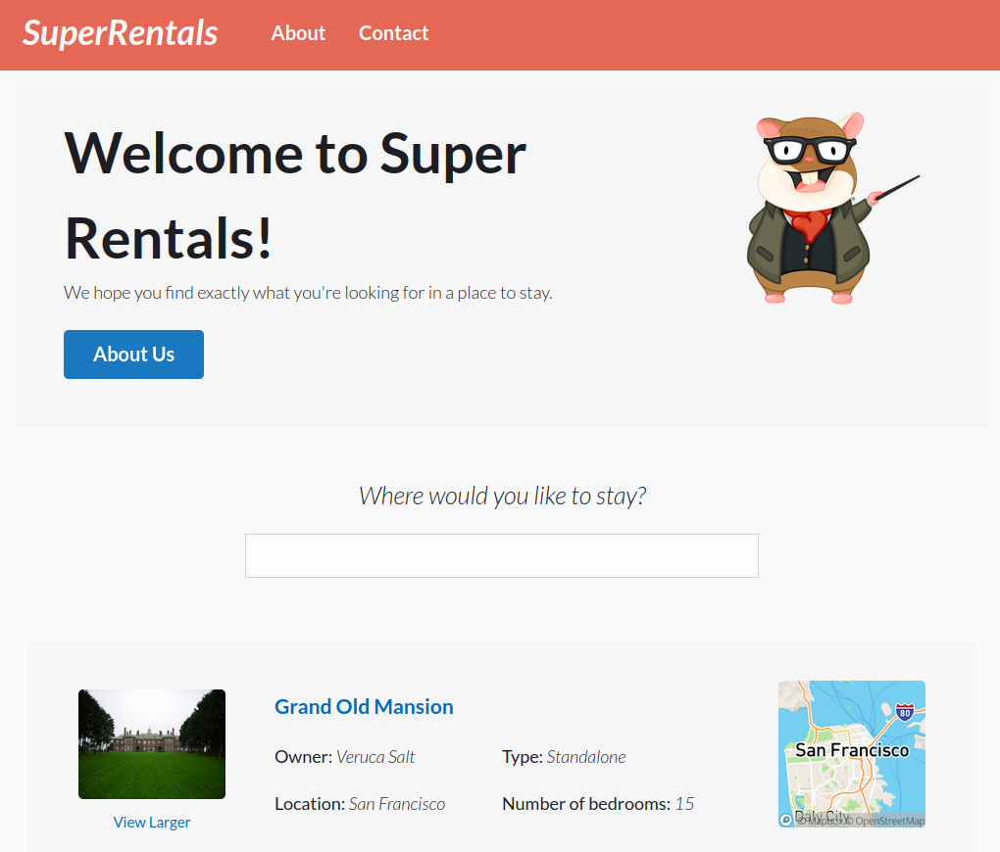
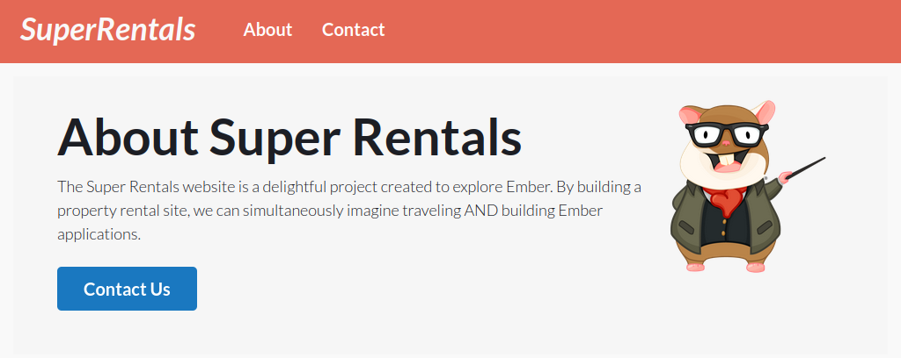
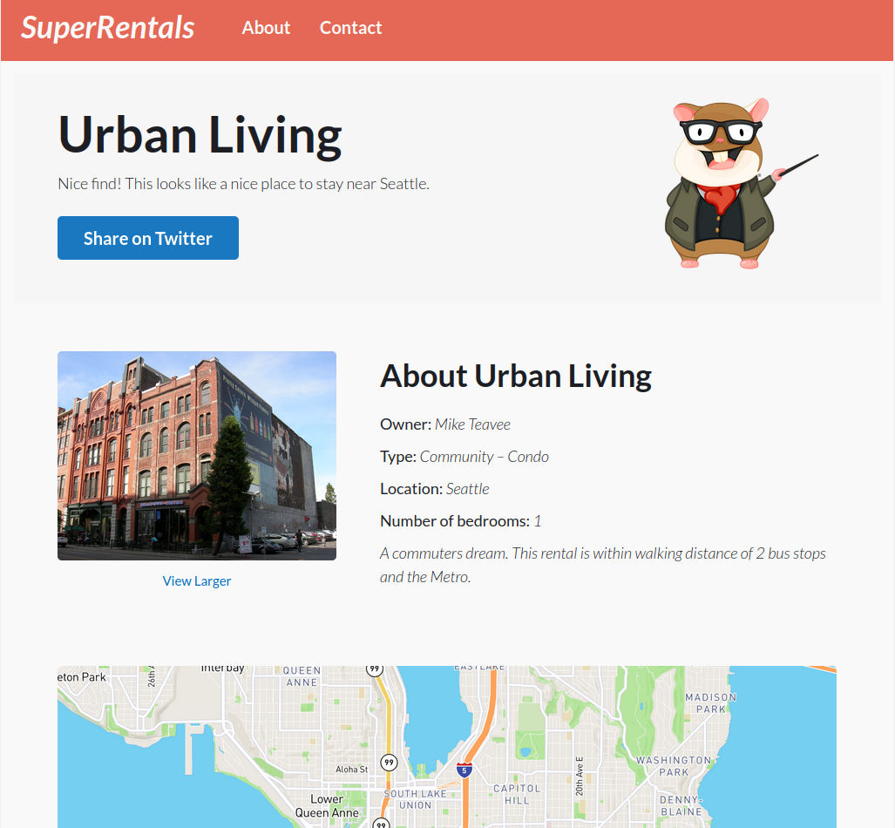

# Super Rentals

## 💻 Projeto

Projeto desenvolvido com base no [Tutorial][tutorial] oferecido pelo [Ember][ember].

## 🛠 Tecnologias

As seguintes tecnologias foram utilizadas no desenvolvimento do projeto:

- [Ember][ember]

## 📷 Screenshots

<kbd>
  
</kbd>

<kbd>
  
</kbd>

<kbd>
  
</kbd>

<kbd>
  
</kbd>

[ember]: https://emberjs.com/
[tutorial]: https://guides.emberjs.com/release/tutorial/part-1/

